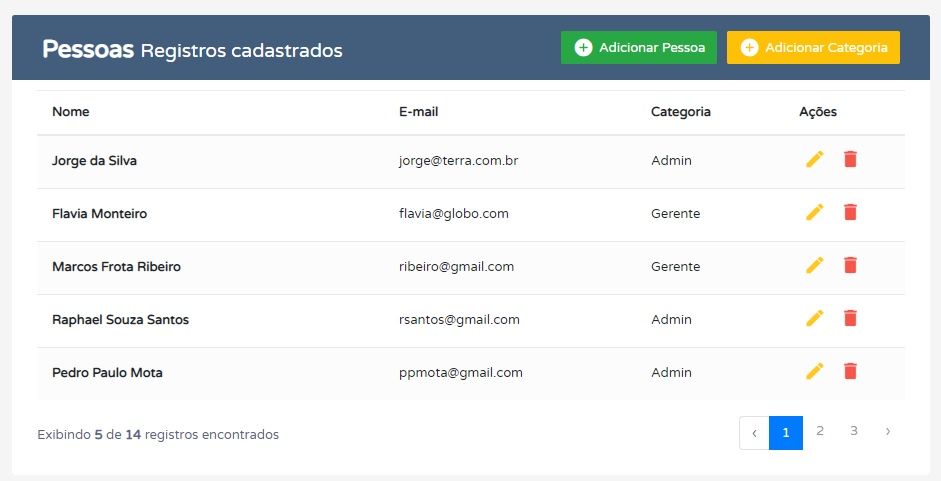

# CRUD PHP Laravel
> Sistema de cadastro de pessoa com categoria desenvolvido em Laravel.

Criação, leitura, alteração e exclusão de dados com o Framework Laravel (PHP) e Banco de Dados (MySql).



## Instalação/Configuração

Configurar Banco de Dados (Arquivo .env DB_CONNECTION=mysql):

```sh
DB_HOST
DB_DATABASE
DB_USERNAME
DB_PASSWORD
DB_PORT
```

Criar tabelas no banco de dados:

```sh
php artisan migrate
```

Popular tabelas no banco de dados:

```sh
php artisan db:seed
```

## Meta

Tarles Walker – [@tarleswalker](https://www.linkedin.com/in/tarles-walker-20086b177/) – tarlescoite@hotmail.com